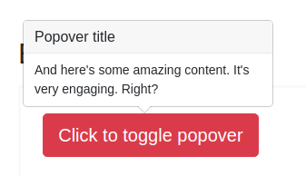

## [веб-сайт](https://a-naraikin.github.io/n-ahj-hw.-5_forms_popovers/)

## Домашняя работа «Работа с HTML-формами: Popovers»

#### Легенда

Есть замечательный фреймворк Bootstrap, в котором реализовано достаточно много интересных виджетов с использованием jQuery. Но, как говорят современные и модные программисты, "jQuery не нужен", поэтому вам нужно реализовать такой же виджет на чистом JS.

#### Описание

Вот так должен выглядеть виджет в целом, для упрощения будем считать, что виджет всегда должен показываться сверху.

У popover'а обязательно должно быть название и текст. Центрироваться он обязательно должен по горизонтали относительно элемента, который вызвал popover'а.

Не забудьте написать авто-тест на взаимодействие с DOM на базе Puppeteer или JSDOM (на ваш выбор).

**Подсказка**: страница, на которой можно "подглядеть" реализацию: https://getbootstrap.com/docs/4.3/components/popovers/. Но мы пока не проходили `translate`, `translate3d`, поэтому делайте позиционирование в px.